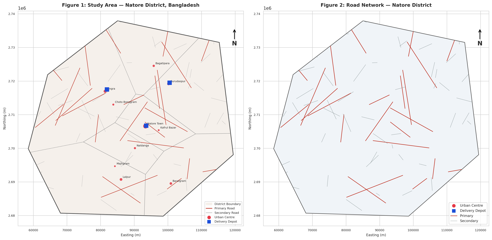
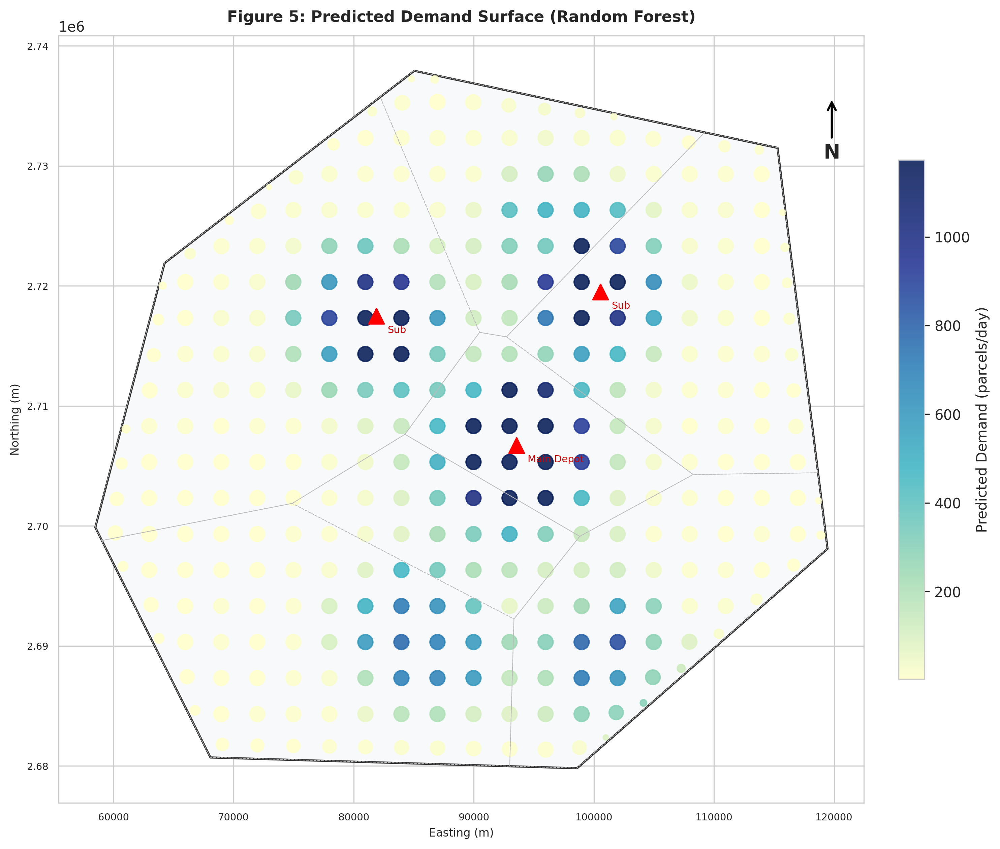
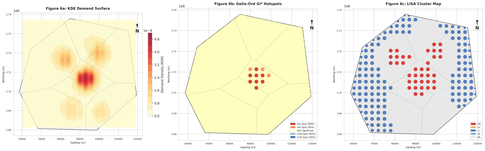
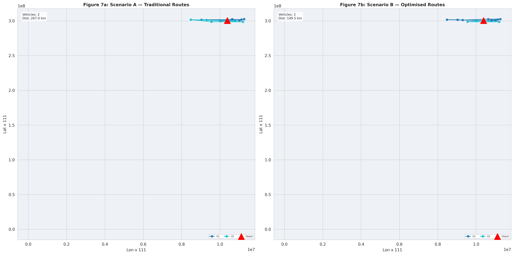
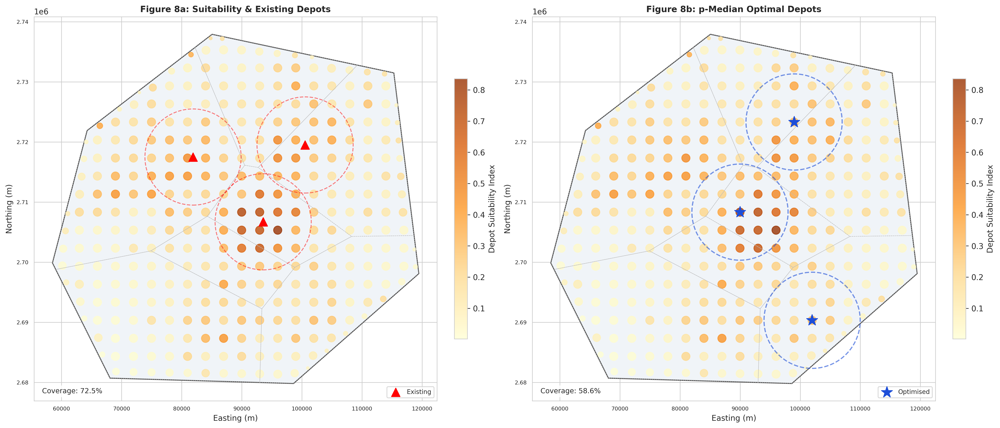
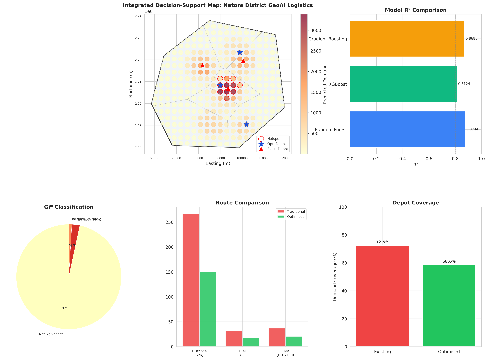

<div align="center">

## GeoAI-Based Urban Delivery Demand Prediction & Route Optimization
### A Case Study of Natore District, Bangladesh

**Geospatial Decision-Support Framework integrating Machine Learning, Spatial Statistics, and Operations Research for Last-Mile Logistics**

<br>

[](https://www.python.org/)
[](https://jupyter.org/)
[](https://geopandas.org/)
[](https://scikit-learn.org/)
[](https://xgboost.readthedocs.io/)
[](https://python-visualization.github.io/folium/)

<br>

[](https://github.com/mdkhademali/natore-geoai-logistics/stargazers)
[](https://github.com/mdkhademali/natore-geoai-logistics/network/members)
[](https://github.com/mdkhademali/natore-geoai-logistics/issues)
[](https://github.com/mdkhademali/natore-geoai-logistics/commits/main)
[](https://github.com/mdkhademali/natore-geoai-logistics)

<br>

**SDG 9** · Industry, Innovation & Infrastructure &nbsp;|&nbsp; **SDG 11** · Sustainable Cities &nbsp;|&nbsp; **SDG 13** · Climate Action

</div>

---

## Overview

This repository presents a **research-grade, publication-ready GeoAI pipeline** that predicts urban delivery demand and optimizes last-mile logistics routes for **Natore District, Bangladesh**, a secondary-city context where formal logistics infrastructure is rapidly emerging alongside explosive e-commerce growth.

The framework fuses **geospatial analysis**, **ensemble machine learning**, **spatial statistics**, and **operations research** into a single, reproducible decision-support system — complete with an **interactive WebGIS dashboard**.

---

## Key Results

<div align="center">

| Metric | Result | Detail |
|:--|:--:|:--|
| **Best Model** | **Random Forest** | R² = **0.874** \| CV R² = 0.606 |
| XGBoost | R² = 0.812 | RMSE = 260.2 |
| Gradient Boosting | R² = 0.869 | RMSE = 217.6 |
| **Spatial Autocorrelation** | **Moran's I = 0.712** | p = 0.001 (highly significant clustering) |
| **Hotspot Cells Detected** | **11 cells** | 8 @ 99% confidence, 3 @ 95% confidence |
| **Route Distance Reduction** | **44.0 %** | 267.0 km → 149.5 km |
| **Operational Cost Reduction** | **44.0 %** | ৳3,685 → ৳2,063 per cycle |
| **Fuel Saved** | **14.1 L** | per delivery cycle |
| **Depots Optimized (p-Median)** | **3 locations** | Demand-weighted coverage re-evaluated @ 8 km radius |

</div>

---

## Study Area

**Natore District**, Rajshahi Division, Bangladesh
~24.42°N, 88.99°E &nbsp;|&nbsp; Area: 1,701 km² &nbsp;|&nbsp; Population: ~1.72M &nbsp;|&nbsp; 7 Upazilas

<p align="center">
  
</p>

---

## Methodology Pipeline


| Stage | Techniques Used |
|---|---|
| **Data Acquisition** | OpenStreetMap road networks, district boundaries, calibrated synthetic demand surfaces |
| **Data Preparation** | CRS standardization (UTM 46N), spatial validation, attribute engineering, 3 km grid |
| **Exploratory Spatial Analysis** | Population/road/demand density mapping, upazila-level statistics |
| **Demand Prediction (GeoAI)** | Random Forest · XGBoost · Gradient Boosting Regressors |
| **Hotspot Detection** | Kernel Density Estimation · Getis-Ord Gi\* · Local Moran's I (LISA) |
| **Route Optimization** | Graph-based Dijkstra shortest path · Nearest-Neighbour VRP heuristic |
| **Depot Optimization** | p-Median facility location · Coverage maximization |
| **Decision Support** | Interactive Folium WebGIS dashboard with 8 toggleable layers |

---

## Visualization Gallery

<table>
<tr>
<td width="50%"></td>
<td width="50%"></td>
</tr>
<tr>
<td align="center"><b>Predicted Demand Surface</b><br><sub>Random Forest zone-level prediction</sub></td>
<td align="center"><b>Spatial Hotspot Analysis</b><br><sub>KDE · Gi* · LISA cluster maps</sub></td>
</tr>
<tr>
<td width="50%"></td>
<td width="50%"></td>
</tr>
<tr>
<td align="center"><b>Route Optimization</b><br><sub>Traditional vs. VRP-optimised scenarios</sub></td>
<td align="center"><b>Depot Suitability & p-Median Siting</b><br><sub>Existing vs. optimised depot coverage</sub></td>
</tr>
</table>

<p align="center">
  
  <br><sub><b>Figure 10</b> — Integrated Decision-Support Dashboard combining demand, hotspots, routes, and depot coverage</sub>
</p>

---

```bash
# Clone the repository
git clone https://github.com/mdkhademali/natore-geoai-logistics.git
cd natore-geoai-logistics

# Install dependencies
pip install geopandas folium osmnx scikit-learn xgboost networkx \
            libpysal esda shapely matplotlib seaborn nbformat

# Launch Jupyter
jupyter notebook Natore_GeoAI_Logistics.ipynb
```

**Core dependencies:** `geopandas` · `folium` · `networkx` · `scikit-learn` · `xgboost` · `libpysal` · `esda` · `shapely` · `matplotlib`

---

## Research Objectives

1. Characterize the spatial distribution of delivery demand across Natore District
2. Develop and compare GeoAI ensemble models for zone-level demand prediction
3. Identify high-demand hotspots using KDE, Getis-Ord Gi\*, and Local Moran's I
4. Optimize multi-vehicle delivery routes under capacity and distance constraints
5. Determine optimal depot locations via p-Median facility location modeling
6. Deliver findings through an interactive WebGIS decision-support dashboard

---

## Model Performance Comparison

| Model | RMSE | MAE | MAPE | R² | CV R² |
|---|:--:|:--:|:--:|:--:|:--:|
| **Random Forest** | **212.92** | **98.32** | 78.65% | **0.8744** | 0.6060 |
| Gradient Boosting | 217.58 | 101.85 | 79.34% | 0.8688 | 0.6089 |
| XGBoost | 260.20 | 113.47 | 77.48% | 0.8124 | 0.5659 |

**Top predictive features:** Urbanisation Index → Population Density → Commercial Activity Index → Distance to Depot

---

## Citation

If you use this framework in your research, please cite:

```bibtex
@misc{ali2025natoregeoai,
  author       = {Ali, Md Khadem},
  title        = {GeoAI-Based Urban Delivery Demand Prediction and Route 
                   Optimization: A Case Study of Natore District, Bangladesh},
  year         = {2025},
  publisher    = {GitHub},
  howpublished = {\url{https://github.com/mdkhademali/natore-geoai-logistics}}
}
```

---

## Author

<div align="center">

### **Md Khadem Ali**

[](https://mdkhademali.com)
[](https://github.com/mdkhademali)

</div>

---

## Acknowledgements

Built using open-source geospatial and machine learning tools: **GeoPandas**, **OSMnx**, **scikit-learn**, **XGBoost**, **NetworkX**, **PySAL/ESDA**, and **Folium**. Spatial datasets calibrated against publicly available OpenStreetMap and administrative boundary references for Bangladesh.

<div align="center">

⭐ **If this project helped your research, consider giving it a star!** ⭐

</div>
